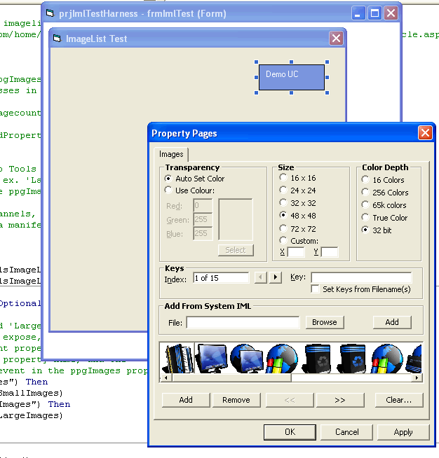



## Integrate a 32b Imagelist as a Usercontrol Property

### Description

March 26 - Added a library check for gdiplus.

March 25 - Added gdiplus routine allowing icons with alpha channels to be drawn without need for a manifest, making 32b alpha icons available on any OS with gdiplus installed.

March 18 - Fixed some issues with the property page and example, and uploaded the new version.

Add multiple, integrated 32 bit image lists with property pages to any usercontrol with this class/property page, and just a couple of simple steps. I will be adding this code to the grid project and thought I'd provide a simple demo..
 
### More Info
 

             |
---                |---
**Submitted On**   |2007-03-26 09:40:38
**By**             |[Steppenwolfe](https://github.com/Planet-Source-Code/PSCIndex/blob/master/ByAuthor/steppenwolfe.md)
**Level**          |Intermediate
**User Rating**    |5.0 (85 globes from 17 users)
**Compatibility**  |VB 6\.0
**Category**       |[Complete Applications](https://github.com/Planet-Source-Code/PSCIndex/blob/master/ByCategory/complete-applications__1-27.md)
**World**          |[Visual Basic](https://github.com/Planet-Source-Code/PSCIndex/blob/master/ByWorld/visual-basic.md)
**Archive File**   |[Integrate\_2056313262007\.zip](https://github.com/Planet-Source-Code/steppenwolfe-integrate-a-32b-imagelist-as-a-usercontrol-property__1-68113/archive/master.zip)

